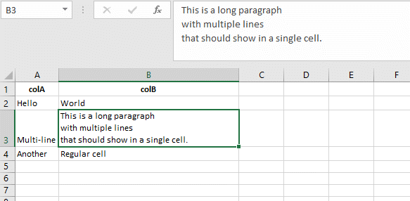

# JSON to Excel for VUE 2

Download your JSON data as an Excel file directly from the browser. This component is based on the solution proposed on [this thread](https://stackoverflow.com/questions/17142427/javascript-to-export-html-table-to-excel)

### Important! Extra prompt in Microsoft Excel

**The method implemented in this component uses HTML tables to draw the .xls files, Microsoft Excel no longer recognize HTML as native content so a warning message will be displayed before opening the file. The content will be rendered perfectly but the message can't be avoided.**

## Getting started

Get the package:

```bash
npm install vue-json-excel
```

Register JsonExcel in your vue app entry point:

```js
import Vue from "vue";
import JsonExcel from "vue-json-excel";

Vue.component("downloadExcel", JsonExcel);
```

In your template

```html
<download-excel :data="json_data">
  Download Data
  
</download-excel>
```

## Props List

| Name                         |     Type     | Description                                                                                                                                                                                              | Default  |
| :--------------------------- | :----------: | -------------------------------------------------------------------------------------------------------------------------------------------------------------------------------------------------------- | :------: |
| data                         |    Array     | Data to be exported.                                                                                                                                                                                     |
| fields                       |    Object    | Fields inside the JSON Object that you want to export. If none provided, all properties in the JSON will be exported.                                                                                    |
| export-fields (exportFields) |    Object    | Used to fix the problem with other components that use the variable fields, like vee-validate. exportFields works exactly like fields                                                                    |
| type                         |    string    | Mime type [xls, csv]                                                                                                                                                                                     |   xls    |
| name                         |    string    | File name to export.                                                                                                                                                                                     | data.xls |
| header                       | string/Array | Title(s) for the data. Can be a string (one title) or an array of strings (multiple titles).                                                                                                             |
| title(deprecated)            | string/Array | same as header, title is maintained for retro-compatibility purposes but its use is not recommended due to the conflict with the HTML5 title attribute.                                                  |
| footer                       | string/Array | Footer(s) for the data. Can be a string (one footer) or an array of strings (multiple footers).                                                                                                          |
| default-value (defaultValue) |    string    | Use as fallback when the row has no field values.                                                                                                                                                        |    ''    |
| worksheet                    |    string    | Name of the worksheet tab.                                                                                                                                                                               | 'Sheet1' |
| fetch                        |   Function   | Callback to fetch data before download, if it's set it runs immediately after mouse pressed and before download process.<br>IMPORTANT: only works if no data prop is defined.                            |
| before-generate              |   Function   | Callback to call a method right before the generate / fetch data, eg:show loading progress                                                                                                               |
| before-finish                |   Function   | Callback to call a method right before the download box pops out, eg:hide loading progress                                                                                                               |
| stringifyLongNum             |   Boolean    | stringify long number and decimal(solve the problem of loss of digital accuracy), default: false                                                                                                         |
| escapeCsv                    |   Boolean    | This escapes CSV values in order to fix some excel problems with number fields. But this will wrap every csv data with **="** and **"**, to avoid that you have to set this prop to false. default: True |

## Example

```js
import Vue from "vue";
import JsonExcel from "vue-json-excel";

Vue.component("downloadExcel", JsonExcel);

const app = new Vue({
  el: "#app",
  data: {
    json_fields: {
      "Complete name": "name",
      City: "city",
      Telephone: "phone.mobile",
      "Telephone 2": {
        field: "phone.landline",
        callback: (value) => {
          return `Landline Phone - ${value}`;
        },
      },
    },
    json_data: [
      {
        name: "Tony Peña",
        city: "New York",
        country: "United States",
        birthdate: "1978-03-15",
        phone: {
          mobile: "1-541-754-3010",
          landline: "(541) 754-3010",
        },
      },
      {
        name: "Thessaloniki",
        city: "Athens",
        country: "Greece",
        birthdate: "1987-11-23",
        phone: {
          mobile: "+1 855 275 5071",
          landline: "(2741) 2621-244",
        },
      },
    ],
    json_meta: [
      [
        {
          key: "charset",
          value: "utf-8",
        },
      ],
    ],
  },
});
```

In your HTML call it like

```html
<download-excel
  class="btn btn-default"
  :data="json_data"
  :fields="json_fields"
  worksheet="My Worksheet"
  name="filename.xls"
>
  Download Excel (you can customize this with html code!)
</download-excel>
```

REQUIRED

- json_data: Contains the data you want to export.
- json_fields: You can select what fields to export. Specify nested data and assign labels to the fields. The key is the label, the value is the JSON field. This will export the field data 'as is'. If you need to customize the the exported data you can define a callback function. Thanks to @gucastiliao.

```js
let json_fields = {
  // regular field (exported data 'as is')
  fieldLabel: attributeName, // nested attribute supported
  // callback function for data formatting
  anotherFieldLabel: {
    field: anotherAttributeName, // nested attribute supported
    callback: (value) => {
      return `formatted value ${value}`;
    },
  },
};
```

json_fields is a object that represents which columns will be exported. If no object is provided, the component will be use the first object in your data array to extract the keys as columns names. Json field example:

```
:export-fields="{
    'Human friendly name': '_name_field_from_json',
    'user's last name': '_last_name_text'
}"
```

## Export CSV

To export JSON as a CSV file, just add the prop `type` with a value of "csv":

```html
<download-excel
  class="btn btn-default"
  :data="json_data"
  :fields="json_fields"
  type="csv"
  name="filename.xls"
>
  Download CSV (you can customize this with html code!)
</download-excel>
```

## Multi-line values will appear in a single cell

A single text value in the data that contains newline characters will appear as a single cell in Excel. This avoids the undesired behavior of multi-line values getting split into multiple cells that must be merged before using data filters and pivot tables.

For example:

```html
<template>
  <div>
    <json-excel :data="dataForExcel" />
  </div>
</template>
<script>
  import JsonExcel from "@/components/JsonExcel";

  export default {
    components: {
      JsonExcel,
    },
    data: () => {
      return {
        dataForExcel: [
          { colA: "Hello", colB: "World" },
          {
            colA: "Multi-line",
            /* Multi-line value: */
            colB:
              "This is a long paragraph\nwith multiple lines\nthat should show in a single cell.",
          },
          { colA: "Another", colB: "Regular cell" },
        ],
      };
    },
  };
</script>
```



## Fetch Data on Demand

In case you need to fetch data from the server, you could use the fetch prop that allows you to define a callback function that is executed when your user click the download button. This function has to return a JSON value containing the data to export. A basic use case is:

```js
<template>
  <div id="app">

    <hr>
    <h2>Fetch Example</h2>
    <downloadexcel
      class            = "btn"
      :fetch           = "fetchData"
      :fields          = "json_fields"
      :before-generate = "startDownload"
      :before-finish   = "finishDownload">
      Download Excel
    </downloadexcel>
  </div>
</template>

<script>
import downloadexcel from "vue-json-excel";
import axios from 'axios';

export default {
  name: "App",
  components: {
    downloadexcel,
  },
  data(){
    return {
      json_fields: {
        'Complete name': 'name',
        'Date': 'date',
      },
    }
  }, //data
  methods:{
    async fetchData(){
      const response = await axios.get('https://holidayapi.com/v1/holidays?key=a4b2083b-1577-4acd-9408-6e529996b129&country=US&year=2017&month=09');
      console.log(response);
      return response.data.holidays;
    },
    startDownload(){
        alert('show loading');
    },
    finishDownload(){
        alert('hide loading');
    }
  }
};
</script>

```

## Using callbacks

when using callback functions in the fields description, you have three option to retrieve data:

- **field: 'path.to.nested.property'** you can retrieve a specific value using the nested property notation.

```js
    json_fields: {
        'Complete name': 'name',
        'City': 'city',
        'Telephone': 'phone.mobile',
        'Telephone 2' : {
            field: 'phone.landline',
            callback: (value) => {
                return `Landline Phone - ${value}`;
            }
        },
    },
```

- **field: 'define.nested.object'** you can retrieve a nested object too.

```js
    json_fields: {s
        'Complete name': 'name',
        'City': 'city',
        'Telephone': 'phone.mobile',
        'Telephone 2' : {
            field: 'phone',
            callback: (value) => {
                return `Landline Phone - ${value.landline}`;
            }
        },
    },
```

- Or **get the whole row** if field is undefined.

```js
    json_fields: {
        'Complete name': 'name',
        'City': 'city',
        'Telephone': 'phone.mobile',
        'Telephone 2' : {
            callback: (value) => {
                return `Landline Phone - ${value.phone.landline}`;
            }
        },
    },
```

## License

MIT

#### Status

This project is in an early stage of development. Any contribution is welcome :D
